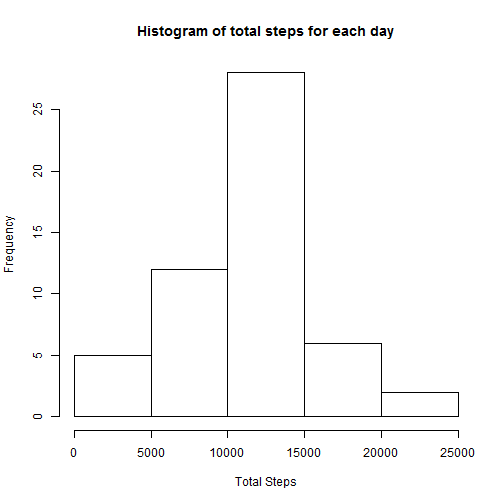
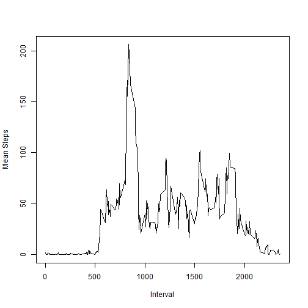
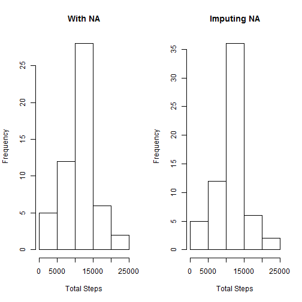
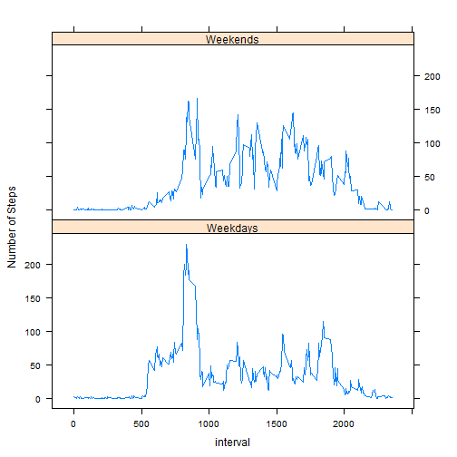

# Reproducible Research: Peer Assessment 1


## Loading and preprocessing the data

```r
dt <- read.csv("activity.csv")
library(reshape2)
dt_melt <- melt(dt, id = c("date", "interval"), meas.vars = c("steps"))
```


## What is mean total number of steps taken per day?

```r
dt_total <- dcast(dt_melt, date ~ variable, sum)
hist(dt_total$steps, main = "Histogram of total steps for each day", xlab = "Total Steps")
```

 

```r

dt_mean <- dcast(dt_melt, date ~ variable, mean)
dt_median <- dcast(dt_melt, date ~ variable, median, fill = 0)
data.frame(date = dt_mean$date, mean = dt_mean$steps, median = dt_median$steps)
```

```
##          date    mean median
## 1  2012-10-01      NA     NA
## 2  2012-10-02  0.4375      0
## 3  2012-10-03 39.4167      0
## 4  2012-10-04 42.0694      0
## 5  2012-10-05 46.1597      0
## 6  2012-10-06 53.5417      0
## 7  2012-10-07 38.2465      0
## 8  2012-10-08      NA     NA
## 9  2012-10-09 44.4826      0
## 10 2012-10-10 34.3750      0
## 11 2012-10-11 35.7778      0
## 12 2012-10-12 60.3542      0
## 13 2012-10-13 43.1458      0
## 14 2012-10-14 52.4236      0
## 15 2012-10-15 35.2049      0
## 16 2012-10-16 52.3750      0
## 17 2012-10-17 46.7083      0
## 18 2012-10-18 34.9167      0
## 19 2012-10-19 41.0729      0
## 20 2012-10-20 36.0938      0
## 21 2012-10-21 30.6285      0
## 22 2012-10-22 46.7361      0
## 23 2012-10-23 30.9653      0
## 24 2012-10-24 29.0104      0
## 25 2012-10-25  8.6528      0
## 26 2012-10-26 23.5347      0
## 27 2012-10-27 35.1354      0
## 28 2012-10-28 39.7847      0
## 29 2012-10-29 17.4236      0
## 30 2012-10-30 34.0938      0
## 31 2012-10-31 53.5208      0
## 32 2012-11-01      NA     NA
## 33 2012-11-02 36.8056      0
## 34 2012-11-03 36.7049      0
## 35 2012-11-04      NA     NA
## 36 2012-11-05 36.2465      0
## 37 2012-11-06 28.9375      0
## 38 2012-11-07 44.7326      0
## 39 2012-11-08 11.1771      0
## 40 2012-11-09      NA     NA
## 41 2012-11-10      NA     NA
## 42 2012-11-11 43.7778      0
## 43 2012-11-12 37.3785      0
## 44 2012-11-13 25.4722      0
## 45 2012-11-14      NA     NA
## 46 2012-11-15  0.1424      0
## 47 2012-11-16 18.8924      0
## 48 2012-11-17 49.7882      0
## 49 2012-11-18 52.4653      0
## 50 2012-11-19 30.6979      0
## 51 2012-11-20 15.5278      0
## 52 2012-11-21 44.3993      0
## 53 2012-11-22 70.9271      0
## 54 2012-11-23 73.5903      0
## 55 2012-11-24 50.2708      0
## 56 2012-11-25 41.0903      0
## 57 2012-11-26 38.7569      0
## 58 2012-11-27 47.3819      0
## 59 2012-11-28 35.3576      0
## 60 2012-11-29 24.4688      0
## 61 2012-11-30      NA     NA
```


## What is the average daily activity pattern?

```r
dt_mean <- dcast(dt_melt, interval ~ variable, mean, na.rm = TRUE)
plot(dt_mean$interval, dt_mean$steps, type = "l", xlab = "Interval", ylab = "Mean Steps")
```

 

```r

# Find interval with maximum number of steps
dt_mean[dt_mean$steps == max(dt_mean$steps), ]
```

```
##     interval steps
## 104      835 206.2
```

Which 5-minute interval, on average across all the days in the dataset, contains the maximum number of steps?  
**Interval 835**.

## Imputing missing values
The missing values are being replaced with the mean number of steps at that 5-min interval for all days.


```r
# No. of rows with NA
length(dt[is.na(dt$steps), ][, 1])
```

```
## [1] 2304
```

```r

# dt_mean <-dcast(dt_melt, date~variable, mean)
dt2 <- read.csv("activity.csv")

# Replacing NAs with the mean number of steps of the interval for all days.
for (x in 1:length(dt2[, 1])) {
    interval <- dt2[x, 3]
    if (is.na(dt2[x, 1])) {
        interval_mean <- dt_mean[dt_mean$interval == interval, ][2]
        dt2[x, 1] <- as.integer(interval_mean)
    }
}

dt_melt2 <- melt(dt2, id = c("date", "interval"), meas.vars = c("steps"))
dt_total2 <- dcast(dt_melt2, date ~ variable, sum)
par(mfrow = c(1, 2))
hist(dt_total$steps, main = "With NA", xlab = "Total Steps")
hist(dt_total2$steps, main = "Imputing NA", xlab = "Total Steps")
```

 

```r

dt_mean2 <- dcast(dt_melt2, date ~ variable, mean)
dt_median2 <- dcast(dt_melt2, date ~ variable, median, fill = 0)
data.frame(date = dt_mean2$date, mean = dt_mean2$steps, median = dt_median2$steps)
```

```
##          date    mean median
## 1  2012-10-01 36.9479   33.5
## 2  2012-10-02  0.4375    0.0
## 3  2012-10-03 39.4167    0.0
## 4  2012-10-04 42.0694    0.0
## 5  2012-10-05 46.1597    0.0
## 6  2012-10-06 53.5417    0.0
## 7  2012-10-07 38.2465    0.0
## 8  2012-10-08 36.9479   33.5
## 9  2012-10-09 44.4826    0.0
## 10 2012-10-10 34.3750    0.0
## 11 2012-10-11 35.7778    0.0
## 12 2012-10-12 60.3542    0.0
## 13 2012-10-13 43.1458    0.0
## 14 2012-10-14 52.4236    0.0
## 15 2012-10-15 35.2049    0.0
## 16 2012-10-16 52.3750    0.0
## 17 2012-10-17 46.7083    0.0
## 18 2012-10-18 34.9167    0.0
## 19 2012-10-19 41.0729    0.0
## 20 2012-10-20 36.0938    0.0
## 21 2012-10-21 30.6285    0.0
## 22 2012-10-22 46.7361    0.0
## 23 2012-10-23 30.9653    0.0
## 24 2012-10-24 29.0104    0.0
## 25 2012-10-25  8.6528    0.0
## 26 2012-10-26 23.5347    0.0
## 27 2012-10-27 35.1354    0.0
## 28 2012-10-28 39.7847    0.0
## 29 2012-10-29 17.4236    0.0
## 30 2012-10-30 34.0938    0.0
## 31 2012-10-31 53.5208    0.0
## 32 2012-11-01 36.9479   33.5
## 33 2012-11-02 36.8056    0.0
## 34 2012-11-03 36.7049    0.0
## 35 2012-11-04 36.9479   33.5
## 36 2012-11-05 36.2465    0.0
## 37 2012-11-06 28.9375    0.0
## 38 2012-11-07 44.7326    0.0
## 39 2012-11-08 11.1771    0.0
## 40 2012-11-09 36.9479   33.5
## 41 2012-11-10 36.9479   33.5
## 42 2012-11-11 43.7778    0.0
## 43 2012-11-12 37.3785    0.0
## 44 2012-11-13 25.4722    0.0
## 45 2012-11-14 36.9479   33.5
## 46 2012-11-15  0.1424    0.0
## 47 2012-11-16 18.8924    0.0
## 48 2012-11-17 49.7882    0.0
## 49 2012-11-18 52.4653    0.0
## 50 2012-11-19 30.6979    0.0
## 51 2012-11-20 15.5278    0.0
## 52 2012-11-21 44.3993    0.0
## 53 2012-11-22 70.9271    0.0
## 54 2012-11-23 73.5903    0.0
## 55 2012-11-24 50.2708    0.0
## 56 2012-11-25 41.0903    0.0
## 57 2012-11-26 38.7569    0.0
## 58 2012-11-27 47.3819    0.0
## 59 2012-11-28 35.3576    0.0
## 60 2012-11-29 24.4688    0.0
## 61 2012-11-30 36.9479   33.5
```


Imputing NA values with the mean value of 5-min interval does not change the overall shape of the histograms 
before and after imputing.

## Are there differences in activity patterns between weekdays and weekends?

```r
dt2$day <- lapply(dt2$date, FUN = function(x) {
    if (length(grep("Sat|Sun", weekdays(as.Date(x))))) {
        "Weekends"
    } else {
        "Weekdays"
    }
})
dt2$day <- factor(dt2$day, levels = c("Weekdays", "Weekends"))
dt2_melt <- melt(dt2, id = c("day", "interval", "date"), meas.vars = c("steps"))
dt2_mean <- dcast(dt2_melt, interval + day ~ variable, mean)

library(lattice)
xyplot(steps ~ interval | day, data = dt2_mean, type = "l", layout = c(1, 2), 
    ylab = "Number of Steps")
```

 


During weekends, activities are more spread out throughout the days. 
During weekdays, there are more activities in the early morning and peak at around 0835h.

